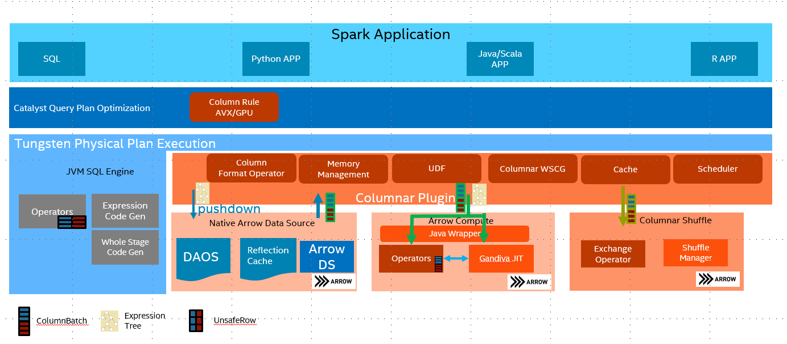
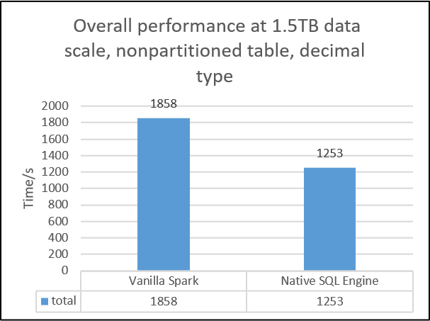
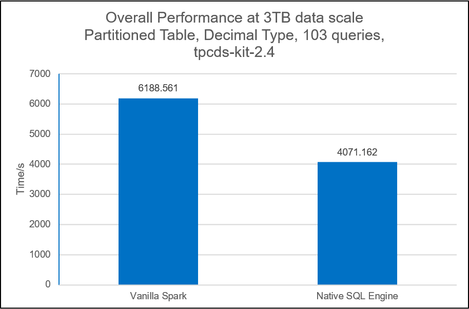

##### \* Gazelle support has officially ended as of February 2023. Please see below information for the end of life announcement.
It's all started from the spark summit session [Apache Arrow-Based Unified Data Sharing and Transferring Format Among CPU and Accelerators](https://www.databricks.com/session/apache-arrow-based-unified-data-sharing-and-transferring-format-among-cpu-and-accelerators). On 4/25/2019, we created Gazelle project to explore the new opportunity to reach higher performance in Spark with vectorized execution engine. We're proud of the work has been done in Gazlle not only to reach better performance beyond Vanilla Spark, but also to unleash the power of hardware capability and bring it into another level. During the time frame to push Gazelle go to the market, we have heard many voices from the customer side to refactor Gazelle source code, leverage Gazelle's JNI as a unified API, as well as to add some existing and mature SQL engine or library such as ClickHouse or Vcelox as the backend support. In 2023, we decide that no longer to support Gazelle project and move to the next stage to extend the experience for Spark with vectorized execution engine support. We encourage the existing Gazelle users or developers move the focus to our 2nd generation native SQL engine - [Gluten](https://github.com/oap-project/gluten), which can provide more possibility with multiple native SQL backend integration as well as more companies work together to build a new ecosystem for Spark vectorized execution engine. Thank you for join with Gazelle's journey and we look forward that you can continue the journey in Gluten with better experience as well.

##### \* LEGAL NOTICE: Your use of this software and any required dependent software (the "Software Package") is subject to the terms and conditions of the software license agreements for the Software Package, which may also include notices, disclaimers, or license terms for third party or open source software included in or with the Software Package, and your use indicates your acceptance of all such terms. Please refer to the "TPP.txt" or other similarly-named text file included with the Software Package for additional details.

##### \* Optimized Analytics Package for Spark* Platform is under Apache 2.0 (https://www.apache.org/licenses/LICENSE-2.0).

# Gazelle Plugin

A Native Engine for Spark SQL with vectorized SIMD optimizations.  Please refer to [user guide](./docs/User-Guide.md) for details on how to enable Gazelle.

## Online Documentation

You can find the all the Gazelle Plugin documents on the [project web page](https://oap-project.github.io/gazelle_plugin/).

## Introduction

Spark SQL works very well with structured row-based data. It used WholeStageCodeGen to improve the performance by Java JIT code. However Java JIT is usually not working very well on utilizing latest SIMD instructions, especially under complicated queries. [Apache Arrow](https://arrow.apache.org/) provided CPU-cache friendly columnar in-memory layout, its SIMD-optimized kernels and LLVM-based SQL engine Gandiva are also very efficient.

Gazelle Plugin reimplements Spark SQL execution layer with SIMD-friendly columnar data processing based on Apache Arrow, 
and leverages Arrow's CPU-cache friendly columnar in-memory layout, SIMD-optimized kernels and LLVM-based expression engine to bring better performance to Spark SQL.

## Performance data

For advanced performance testing, below charts show the results by using two benchmarks with Gazelle v1.1: 1. Decision Support Benchmark1 and 2. Decision Support Benchmark2.
The testing environment for Decision Support Benchmark1 is using 1 master + 3 workers and Intel(r) Xeon(r) Gold 6252 CPU|384GB memory|NVMe SSD x3 per single node with 1.5TB dataset and parquet format.
* Decision Support Benchmark1 is a query set modified from [TPC-H benchmark](http://tpc.org/tpch/default5.asp). We change Decimal to Double since Decimal hasn't been supported in OAP v1.0-Gazelle Plugin.
Overall, the result shows a 1.49X performance speed up from OAP v1.0-Gazelle Plugin comparing to Vanilla SPARK 3.0.0.
We also put the detail result by queries, most of queries in Decision Support Benchmark1 can take the advantages from Gazelle Plugin. The performance boost ratio may depend on the individual query.

The testing environment for Decision Support Benchmark2 is using 1 master + 3 workers and Intel(r) Xeon(r) Platinum 8360Y CPU|1440GB memory|NVMe SSD x4 per single node with 3TB dataset and parquet format.
* Decision Support Benchmark2 is a query set modified from [TPC-DS benchmark](http://tpc.org/tpcds/default5.asp). We change Decimal to Doubel since Decimal hasn't been supported in OAP v1.0-Gazelle Plugin.
We pick up 10 queries which can be fully supported in OAP v1.0-Gazelle Plugin and the result shows a 1.26X performance speed up comparing to Vanilla SPARK 3.0.0.

Please notes the performance data is not an official from TPC-H and TPC-DS. The actual performance result may vary by individual workloads. Please try your workloads with Gazelle Plugin first and check the DAG or log file to see if all the operators can be supported in OAP-Gazelle Plugin. Please check the [detailed page](./docs/performance.md) on performance tuning for TPC-H and TPC-DS workloads.

## Coding Style

* For Java code, we used [google-java-format](https://github.com/google/google-java-format)
* For Scala code, we used [Spark Scala Format](https://github.com/apache/spark/blob/master/dev/.scalafmt.conf), please use [scalafmt](https://github.com/scalameta/scalafmt) or run ./scalafmt for scala codes format
* For Cpp codes, we used Clang-Format, check on this link [google-vim-codefmt](https://github.com/google/vim-codefmt) for details.

## Contact

weiting.chen@intel.com
binwei.yang@intel.com
