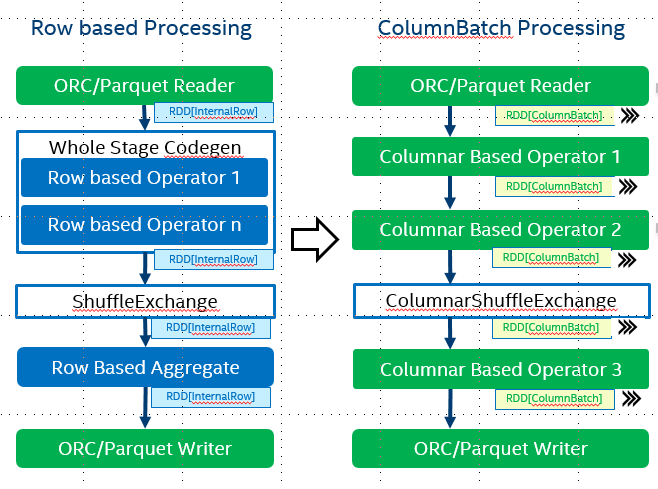
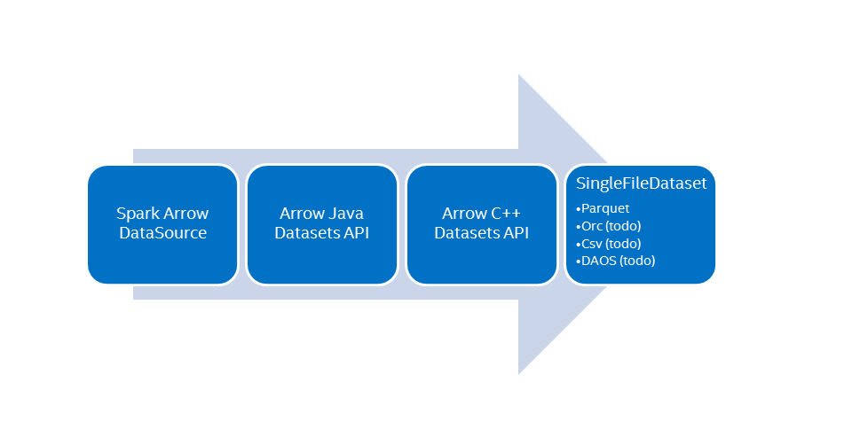
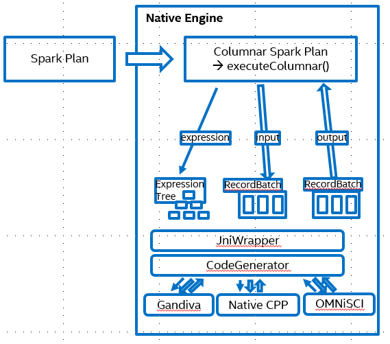
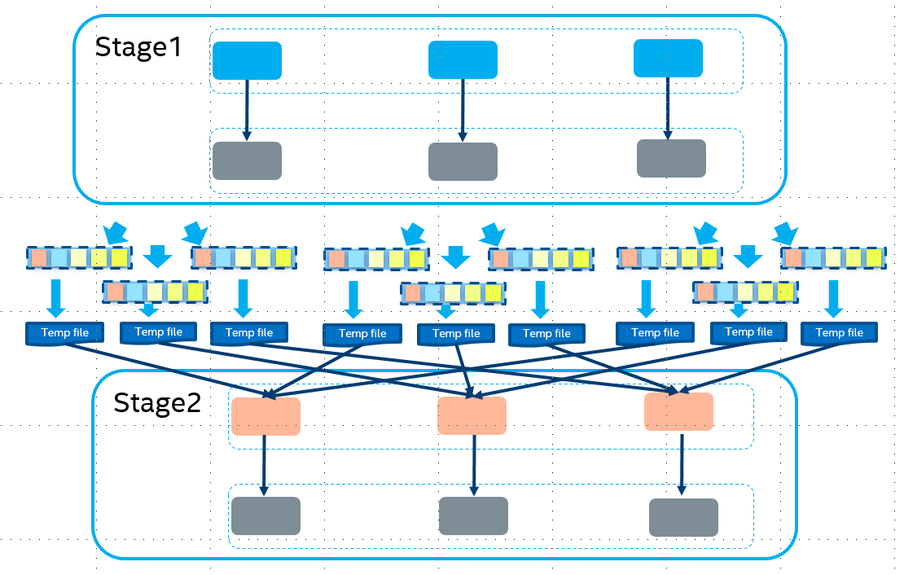
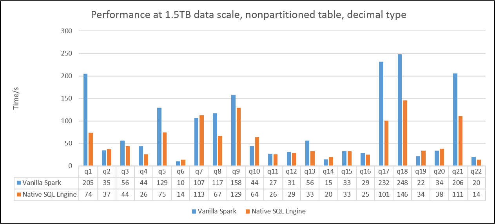
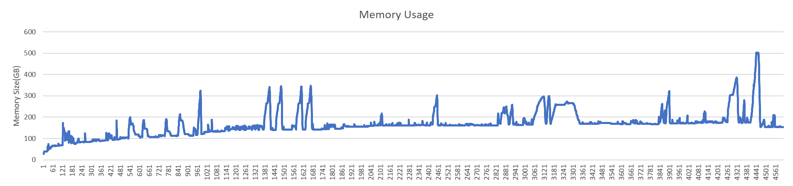

##### \* LEGAL NOTICE: Your use of this software and any required dependent software (the "Software Package") is subject to the terms and conditions of the software license agreements for the Software Package, which may also include notices, disclaimers, or license terms for third party or open source software included in or with the Software Package, and your use indicates your acceptance of all such terms. Please refer to the "TPP.txt" or other similarly-named text file included with the Software Package for additional details.

##### \* Optimized Analytics Package for Spark* Platform is under Apache 2.0 (https://www.apache.org/licenses/LICENSE-2.0).

# Gazelle Plugin

A Native Engine for Spark SQL with vectorized SIMD optimizations

## Online Documentation

You can find the all the Gazelle Plugin documents on the [project web page](https://oap-project.github.io/gazelle_plugin/).

## Introduction


Spark SQL works very well with structured row-based data. It used WholeStageCodeGen to improve the performance by Java JIT code. However Java JIT is usually not working very well on utilizing latest SIMD instructions, especially under complicated queries. [Apache Arrow](https://arrow.apache.org/) provided CPU-cache friendly columnar in-memory layout, its SIMD-optimized kernels and LLVM-based SQL engine Gandiva are also very efficient.

Gazelle Plugin reimplements Spark SQL execution layer with SIMD-friendly columnar data processing based on Apache Arrow, 
and leverages Arrow's CPU-cache friendly columnar in-memory layout, SIMD-optimized kernels and LLVM-based expression engine to bring better performance to Spark SQL.


## Key Features

### Apache Arrow formatted intermediate data among Spark operator



With [Spark 27396](https://issues.apache.org/jira/browse/SPARK-27396) its possible to pass a RDD of Columnarbatch to operators. We implemented this API with Arrow columnar format.

### Apache Arrow based Native Readers for Parquet and other formats



A native parquet reader was developed to speed up the data loading. it's based on Apache Arrow Dataset. For details please check [Arrow Data Source](https://github.com/oap-project/native-sql-engine/tree/master/arrow-data-source)
Note both data source V1 and V2 are supported. Please check the [example section](arrow-data-source/#run-a-query-with-arrowdatasource-scala) for arrow data source

### Apache Arrow Compute/Gandiva based operators



We implemented common operators based on Apache Arrow Compute and Gandiva. The SQL expression was compiled to one expression tree with protobuf and passed to native kernels. The native kernels will then evaluate the these expressions based on the input columnar batch.

### Native Columnar Shuffle Operator with efficient compression support



We implemented columnar shuffle to improve the shuffle performance. With the columnar layout we could do very efficient data compression for different data format.

Please check the operator supporting details [here](./docs/operators.md)

## How to use OAP: Gazelle Plugin

There are three ways to use OAP: Gazelle Plugin,
1. Use precompiled jars
2. Building by Conda Environment
3. Building by Yourself

### Use precompiled jars

Please go to [OAP's Maven Central Repository](https://repo1.maven.org/maven2/com/intel/oap/) to find Gazelle Plugin jars.
For usage, you will require below two jar files:
1. spark-arrow-datasource-standard-<version>-jar-with-dependencies.jar is located in com/intel/oap/spark-arrow-datasource-standard/<version>/
2. spark-columnar-core-<version>-jar-with-dependencies.jar is located in com/intel/oap/spark-columnar-core/<version>/
Please notice the files are fat jars shipped with our custom Arrow library and pre-compiled from our server(using GCC 9.3.0 and LLVM 7.0.1), which means you will require to pre-install GCC 9.3.0 and LLVM 7.0.1 in your system for normal usage. 

### Building by Conda

If you already have a working Hadoop Spark Cluster, we provide a Conda package which will automatically install dependencies needed by OAP, you can refer to [OAP-Installation-Guide](./docs/OAP-Installation-Guide.md) for more information. Once finished [OAP-Installation-Guide](./docs/OAP-Installation-Guide.md), you can find built `spark-columnar-core-<version>-jar-with-dependencies.jar` under `$HOME/miniconda2/envs/oapenv/oap_jars`.
Then you can just skip below steps and jump to [Get Started](#get-started).

### Building by yourself

If you prefer to build from the source code on your hand, please follow below steps to set up your environment.

#### Prerequisite

There are some requirements before you build the project.
Please check the document [Prerequisite](./docs/Prerequisite.md) and make sure you have already installed the software in your system.
If you are running a SPARK Cluster, please make sure all the software are installed in every single node.

#### Installation

Please check the document [Installation Guide](./docs/Installation.md) 

## Get started

To enable Gazelle Plugin, the previous built jar `spark-columnar-core-<version>-jar-with-dependencies.jar` should be added to Spark configuration. We also recommend to use `spark-arrow-datasource-standard-<version>-jar-with-dependencies.jar`. We will demonstrate an example by using both jar files.
SPARK related options are:

* `spark.driver.extraClassPath` : Set to load jar file to driver.
* `spark.executor.extraClassPath` : Set to load jar file to executor.
* `jars` : Set to copy jar file to the executors when using yarn cluster mode.
* `spark.executorEnv.ARROW_LIBHDFS3_DIR` : Optional if you are using a custom libhdfs3.so.
* `spark.executorEnv.LD_LIBRARY_PATH` : Optional if you are using a custom libhdfs3.so.

For Spark Standalone Mode, please set the above value as relative path to the jar file.
For Spark Yarn Cluster Mode, please set the above value as absolute path to the jar file.

More Configuration, please check the document [Configuration Guide](./docs/Configuration.md)

Example to run Spark Shell with ArrowDataSource jar file
```
${SPARK_HOME}/bin/spark-shell \
        --verbose \
        --master yarn \
        --driver-memory 10G \
        --conf spark.plugins=com.intel.oap.GazellePlugin \
        --conf spark.driver.extraClassPath=$PATH_TO_JAR/spark-arrow-datasource-standard-<version>-jar-with-dependencies.jar:$PATH_TO_JAR/spark-columnar-core-<version>-jar-with-dependencies.jar \
        --conf spark.executor.extraClassPath=$PATH_TO_JAR/spark-arrow-datasource-standard-<version>-jar-with-dependencies.jar:$PATH_TO_JAR/spark-columnar-core-<version>-jar-with-dependencies.jar \
        --conf spark.shuffle.manager=org.apache.spark.shuffle.sort.ColumnarShuffleManager \
        --conf spark.driver.cores=1 \
        --conf spark.executor.instances=12 \
        --conf spark.executor.cores=6 \
        --conf spark.executor.memory=20G \
        --conf spark.memory.offHeap.enabled=true \
        --conf spark.memory.offHeap.size=20G \
        --conf spark.task.cpus=1 \
        --conf spark.locality.wait=0s \
        --conf spark.sql.shuffle.partitions=72 \
        --conf spark.executorEnv.ARROW_LIBHDFS3_DIR="$PATH_TO_LIBHDFS3_DIR/" \
        --conf spark.executorEnv.LD_LIBRARY_PATH="$PATH_TO_LIBHDFS3_DEPENDENCIES_DIR"
        --jars $PATH_TO_JAR/spark-arrow-datasource-standard-<version>-jar-with-dependencies.jar,$PATH_TO_JAR/spark-columnar-core-<version>-jar-with-dependencies.jar
```

Here is one example to verify if Gazelle Plugin works, make sure you have TPC-H dataset.  We could do a simple projection on one parquet table. For detailed testing scripts, please refer to [Solution Guide](https://github.com/Intel-bigdata/Solution_navigator/tree/master/nativesql).
```
val orders = spark.read.format("arrow").load("hdfs:////user/root/data_tpch_10/orders")
orders.createOrReplaceTempView("orders")
spark.sql("select * from orders where o_orderdate > date '1998-07-26'").show(20000, false)
```

The result should showup on Spark console and you can check the DAG diagram with some Columnar Processing stage. Gazelle Plugin still lacks some features, please check out the [limitations](./docs/limitations.md).

## Cloud/K8s Integration

### Amazon EMR

Please refer to [Gazelle_on_EMR](https://github.com/oap-project/oap-tools/tree/master/integrations/oap/emr) to find details about how to use OAP Gazelle on Amazon EMR Cloud.

###  Google Cloud Dataproc

Gazelle Plugin now supports to run on Dataproc 2.0, we provide a guide to help quickly install Gazelle Plugin and run TPC-DS with notebooks or scripts.

Please refer to [Gazelle_on_Dataproc](https://github.com/oap-project/oap-tools/blob/master/docs/Gazelle_on_Dataproc.md) to find details about:

1. Create a cluster on Dataproc 2.0 with initialization actions. 
Gazelle Plugin jars compiled with `-Pdataproc-2.0` parameter will installed by Conda in all cluster nodes.
   
2. Config for enabling Gazelle Plugin.

3. Run TPC-DS with notebooks or scripts.

You can also find more information about how to use [OAP on Google Dataproc](https://github.com/oap-project/oap-tools/tree/master/integrations/oap/dataproc).

### Docker Image and Kubernetes Support

For Kubernetes Support, please refer to [OAP on Kubernetes](https://github.com/oap-project/oap-tools/tree/master/integrations/oap/kubernetes)

For how to build the Docker Image, please refer to [OAP Dockerfiles](https://github.com/oap-project/oap-tools/tree/master/integrations/oap/kubernetes/docker)

For using an existing Docker Image, please check the repository [OAP Docker Image](https://hub.docker.com/r/cwt95m/oap) and [Gazelle Docker Image](https://hub.docker.com/r/cwt95m/gazelle)

## Performance data

For advanced performance testing, below charts show the results by using two benchmarks with Gazelle v1.1: 1. Decision Support Benchmark1 and 2. Decision Support Benchmark2.
The testing environment for Decision Support Benchmark1 is using 1 master + 3 workers and Intel(r) Xeon(r) Gold 6252 CPU|384GB memory|NVMe SSD x3 per single node with 1.5TB dataset and parquet format.
* Decision Support Benchmark1 is a query set modified from [TPC-H benchmark](http://tpc.org/tpch/default5.asp). We change Decimal to Double since Decimal hasn't been supported in OAP v1.0-Gazelle Plugin.
Overall, the result shows a 1.49X performance speed up from OAP v1.0-Gazelle Plugin comparing to Vanilla SPARK 3.0.0.
We also put the detail result by queries, most of queries in Decision Support Benchmark1 can take the advantages from Gazelle Plugin. The performance boost ratio may depend on the individual query.




The testing environment for Decision Support Benchmark2 is using 1 master + 3 workers and Intel(r) Xeon(r) Platinum 8360Y CPU|1440GB memory|NVMe SSD x4 per single node with 3TB dataset and parquet format.
* Decision Support Benchmark2 is a query set modified from [TPC-DS benchmark](http://tpc.org/tpcds/default5.asp). We change Decimal to Doubel since Decimal hasn't been supported in OAP v1.0-Gazelle Plugin.
We pick up 10 queries which can be fully supported in OAP v1.0-Gazelle Plugin and the result shows a 1.26X performance speed up comparing to Vanilla SPARK 3.0.0.


Please notes the performance data is not an official from TPC-H and TPC-DS. The actual performance result may vary by individual workloads. Please try your workloads with Gazelle Plugin first and check the DAG or log file to see if all the operators can be supported in OAP-Gazelle Plugin. Please check the [detailed page](./docs/performance.md) on performance tuning for TPC-H and TPC-DS workloads.

## Memory allocation
The memory usage in Gazelle Plugin is high. The allocations goes to two parts: 1) Java based allocation which is widely used in Arrow Java API. 2) Native side memory allocation used in each native kernel. We investigated the memory allocation behavior and made more turnings [here](./docs/memory.md), the memroy footprint is stable during a TPC-DS power run.



## Coding Style

* For Java code, we used [google-java-format](https://github.com/google/google-java-format)
* For Scala code, we used [Spark Scala Format](https://github.com/apache/spark/blob/master/dev/.scalafmt.conf), please use [scalafmt](https://github.com/scalameta/scalafmt) or run ./scalafmt for scala codes format
* For Cpp codes, we used Clang-Format, check on this link [google-vim-codefmt](https://github.com/google/vim-codefmt) for details.

## Contact

weiting.chen@intel.com
binwei.yang@intel.com
