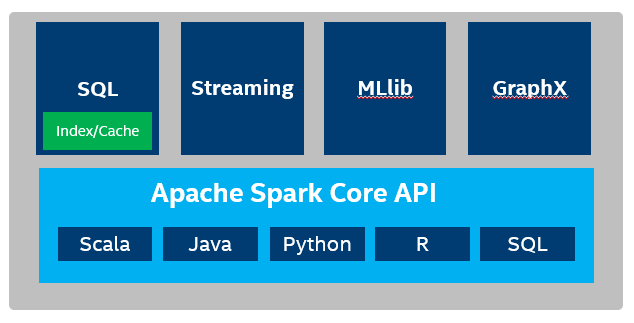
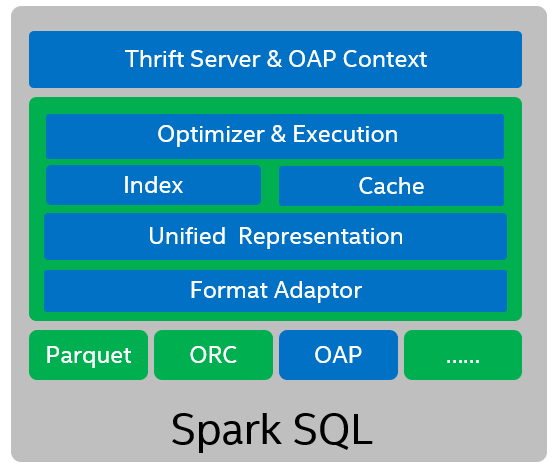

# OAP Architecture Overview


* [Introduction](#introduction)
* [Usage Scenarios](#Usage-Scenarios)
* [OAP Architecture](#oap-architecture)
* [OAP Features](#oap-Features)


## Introduction

Apache Spark is a unified analytics engine for large-scale data processing. Spark SQL* is the most popular component of Apache Spark* and it is widely used to process large scale structured data in data center. However, Spark SQL still suffers from stability and performance challenges in the highly dynamic environment with ultra large scale of data for various use cases.

So we created OAP (Optimized Analytical Package for Spark) to address the performance issues for some of the use cases. OAP is designed to leverage the user defined indices and smart fine-grained in-memory data caching strategy for boosting Spark SQL performance.




## Usage Scenarios

#### Usage Scenario 1 -- Interactive queries

Most customers adopted Spark SQL as a batch processing engine. Customers finally found themselves in the situation that is too hard to separate batch processing and interactive use cases. Interactive queries need to return the data in seconds or even sub-seconds instead of minutes or hours in batch processing. This is hard and challenging for the current Spark SQL implementation.

For example, the following interactive query wants to filter out a very small result set from a huge fact table.

```
select query, term, userid, planid, unitid, winfoid, bmm_type, cmatch, charge, wctrl, target_url, audience_targeting_tag, is_url_targeting_adv, pluto_idea_type
from basedata.fc_ad_wise
where (event_day='20180701' and query='xxx' and winfoid='65648180412')
limit 10
```

Interactive queries usually process on a large data set but return a small portion of data filtering out with a specific condition. Customers are facing big challenges in meeting the performance requirement of interactive queries as we want the result returned in seconds instead of tens of minutes or even hours. 

By creating and storing a full B+ Tree index for key columns and using smart fine-grained in-memory data caching strategy, we can boost Spark SQL interactive queries to seconds and even sub-seconds.

OAP is a package for Spark to speed up interactive queries (ad-hoc queries) by utilizing index and cache technologies. By properly using index and cache, the performance of some interactive queries can possible be improved by order of magnitude.

#### Usage Scenario 2 -- Batch processing jobs 

Customers usually use Spark SQL for Business Analytics in Data Warehousing.

OAP can speed up batch processing jobs with cache technologies. 

OAP provides two cache strategies: Automatically cache hot data and specifically cache hot tables. Users can choose either strategy according to the actual situation.


## OAP Architecture


The following diagram shows the OAP architect design 



OAP (Optimized Analytical Package for Spark) acts as a plugin jar for Spark SQL.
- We designed the compatible adaptor layer for three columnar storage fileformat: parquet, orc and oap(parquet-like fileformat defined by OAP). OAP has ***Unified Cache Representation*** for different columnar storage fileformat, just fine-grained cache unit for one column of a RowGroup.

- OAP's two major optimization functionalities index & cache base on unified representation and adaptor. 
   - Index can be created on one or multiple columns of data file. 
    - Currently, OAP only caches decompressed and decoding data, and will support raw data in the future. Generally, the server's DRAM is used as the cache medium. [DCPMM](https://www.intel.com/content/www/us/en/architecture-and-technology/optane-dc-persistent-memory.html) can also be used as the cache medium, it will provide a more cost effective solution for high performance environment requirement.

- Both index and cache as ***OAP Optimizer & Execution*** are transparent for users. See the [OAP Features](#OAP-Features) section for details.

- Using Spark ***ThriftServer*** can unleash the power of OAP, because ThriftServer can launch a Spark Application which can cache hot data for long time in the background, and it also can accept query requests from different clients at the same time. Of course, using bin/spark-sql, bin/spark-shell or bin/pyspark can also use OAP, but usually only for interactive test situations.


## OAP Features

OAP has two major features:  index and cache, for boosting Spark SQL performance on ad-hoc queries and batch processing jobs.


### Index 

Users can use SQL DDL(create/drop/refresh/check/show index) to use OAP index functionality.
Once users create indexes using DDL, index files mainly composed of index data and statistics will be generated in a specific directory. 
When queries are executed, analyzing index files for boost performance is transparent to users.

- BTREE, BITMAP Index is an optimization that is widely used in traditional databases. We also adopt this two most used index types in OAP project. BTREE index is intended for datasets that has a lot of distinct values, and distributed randomly, such as telephone number or ID number. BitMap index is intended for datasets with a limited total amount of distinct values, such as state or age.

- Statistics locates in the Index file, after all index data written into index file. Sometimes, reading index could bring extra cost for some queries. So we also support four statistics (MinMax, Bloom Filter, SampleBase and PartByValue) to help filter. With statistics, we can make sure we only use index if we can possibly boost the execution.


### Cache

Cache is another core feature of OAP. It is also transparent to users. OAP can load hot data frequently queried automatically, and evict data automatically according to the LRU policy when cache is full.
OAP Cache has the following characteristics:

- OAP cache uses Off-Heap memory and stay out of JVM GC. Also OAP cache can use [DCPMM](https://www.intel.com/content/www/us/en/architecture-and-technology/optane-dc-persistent-memory.html) as high-performance, high-capacity, low-cost memory
- Cache-Locality. OAP can schedule computing task to one executor which holds needed data in cache, by implementing a cache aware mechanism based on Spark driver and executors communication.
- Cache granularity. A column in one RowGroup (equivalent to Stripe in ORC) of a column-oriented storage format file is loaded into a basic cache unit which is called "Fiber" in OAP.
- Cache Eviction. OAP cache eviction uses LRU policy, and automatically cache and evict data with transparently to end user.
- Cache configured tables. OAP also supports caching specific tables by configuration items according to actual situations, these tables are usually hot tables that are often used.


