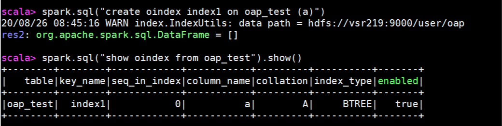
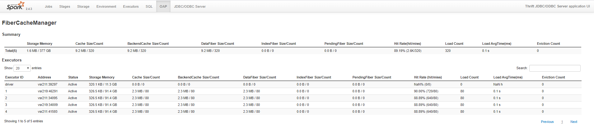

# User Guide

* [Prerequisites](#Prerequisites)
* [Getting Started](#Getting-Started)
* [Configuration for YARN Cluster Mode](#Configuration-for-YARN-Cluster-Mode)
* [Configuration for Spark Standalone Mode](#Configuration-for-Spark-Standalone-Mode)
* [Working with SQL Index](#Working-with-SQL-Index)
* [Working with SQL Data Source Cache](#Working-with-SQL-Data-Source-Cache)
* [Run TPC-DS Benchmark](#Run-TPC-DS-Benchmark)
* [Advanced Configuration](#Advanced-Configuration)


## Prerequisites

SQL Index and Data Source Cache on Spark requires a working Hadoop cluster with YARN and Spark. Running Spark on YARN requires a binary distribution of Spark, which is built with YARN support. If you don't want to build Spark by yourself, we have pre-built [spark-3.0.0](https://github.com/Intel-bigdata/spark/releases/download/v3.0.0-intel-oap-0.9.0/spark-3.0.0-bin-hadoop2.7-intel-oap-0.9.0.tgz ).

## Getting Started

### Building

Download our pre-built jar [oap-0.8.2-bin-spark-2.4.4.tar.gz](https://github.com/Intel-bigdata/OAP/releases/download/v0.8.2-spark-2.4.4/oap-0.8.2-bin-spark-2.4.4.tar.gz) to your working node, unzip it and put the jars to your working directory such as `/home/oap/jars/`. If you’d like to build from source code, please refer to [Developer Guide](Developer-Guide.md) for the detailed steps.

### Spark Configurations

Users usually test and run Spark SQL or Scala scripts in Spark Shell,  which launches Spark applications on YRAN with ***client*** mode. In this section, we will start with Spark Shell then introduce other use scenarios. 

Before you run ` . $SPARK_HOME/bin/spark-shell `, you need to configure Spark for integration. You need to add or update the following configurations in the Spark configuration file `$SPARK_HOME/conf/spark-defaults.conf` on your working node.

```
spark.sql.extensions              org.apache.spark.sql.OapExtensions
# absolute path of the jar on your working node
spark.files                       /home/oap/jars/oap-cache-<version>-with-spark-<version>.jar,/home/oap/jars/oap-common-<version>-with-spark-<version>.jar
# relative path of the jar
spark.executor.extraClassPath     ./oap-cache-<version>-with-spark-<version>.jar:./oap-common-<version>-with-spark-<version>.jar
# absolute path of the jar on your working node
spark.driver.extraClassPath       /home/oap/jars/oap-cache-<version>-with-spark-<version>.jar:/home/oap/jars/oap-common-<version>-with-spark-<version>.jar
```
### Verify Integration 

After configuration, you can follow these steps to verify the OAP integration is working using Spark Shell.

1. Create a test data path on your HDFS. `hdfs:///user/oap/` for example.
   ```
   hadoop fs -mkdir /user/oap/
   
   ```
2. Launch Spark Shell using the following command on your working node.
   ``` 
   . $SPARK_HOME/bin/spark-shell
   ```

3. Execute the following commands in Spark Shell to test OAP integration. 
   ```
   > spark.sql(s"""CREATE TABLE oap_test (a INT, b STRING)
          USING parquet
          OPTIONS (path 'hdfs:///user/oap/')""".stripMargin)
   > val data = (1 to 30000).map { i => (i, s"this is test $i") }.toDF().createOrReplaceTempView("t")
   > spark.sql("insert overwrite table oap_test select * from t")
   > spark.sql("create oindex index1 on oap_test (a)")
   > spark.sql("show oindex from oap_test").show()
   ```

This test creates an index for a table and then shows it. If there are no errors, the OAP `.jar` is working with the configuration. The picture below is an example of a successfully run.



## Configuration for YARN Cluster Mode

Spark Shell, Spark SQL CLI and Thrift Sever run Spark application in ***client*** mode. While Spark Submit tool can run Spark application in ***client*** or ***cluster*** mode, which is decided by `--deploy-mode` parameter. [Getting Started](#Getting-Started) session has shown the configurations needed for ***client*** mode. If you are running Spark Submit tool in ***cluster*** mode, you need to follow the below configuration steps instead.

Add the following OAP configuration settings to `$SPARK_HOME/conf/spark-defaults.conf` on your working node before running `spark-submit` in ***cluster*** mode.
```
spark.sql.extensions              org.apache.spark.sql.OapExtensions
# absolute path on your working node
spark.files                       /home/oap/jars/oap-cache-<version>-with-spark-<version>.jar,/home/oap/jars/oap-common-<version>-with-spark-<version>.jar
# relative path    
spark.executor.extraClassPath     ./oap-cache-<version>-with-spark-<version>.jar:./oap-common-<version>-with-spark-<version>.jar
# relative path 
spark.driver.extraClassPath       ./oap-cache-<version>-with-spark-<version>.jar:./oap-common-<version>-with-spark-<version>.jar
```

## Configuration for Spark Standalone Mode

In addition to running on the YARN cluster manager, Spark also provides a simple standalone deploy mode. If you are using Spark in Spark Standalone mode:

1. Copy the OAP `.jar` to **all** the worker nodes. 
2. Add the following configuration settings to `$SPARK_HOME/conf/spark-defaults.conf` to the working node.
```
spark.sql.extensions               org.apache.spark.sql.OapExtensions
# absolute path on worker nodes
spark.executor.extraClassPath      /home/oap/jars/oap-cache-<version>-with-spark-<version>.jar:/home/oap/jars/oap-common-<version>-with-spark-<version>.jar
# absolute path on worker nodes
spark.driver.extraClassPath        /home/oap/jars/oap-cache-<version>-with-spark-<version>.jar:/home/oap/jars/oap-common-<version>-with-spark-<version>.jar
```

## Working with SQL Index

After a successful OAP integration, you can use OAP SQL DDL to manage table indexes. The DDL operations include `index create`, `drop`, `refresh`, and `show`. Test these functions using the following examples in Spark Shell.

```
> spark.sql(s"""CREATE TABLE oap_test (a INT, b STRING)
       USING parquet
       OPTIONS (path 'hdfs:///user/oap/')""".stripMargin)
> val data = (1 to 30000).map { i => (i, s"this is test $i") }.toDF().createOrReplaceTempView("t")
> spark.sql("insert overwrite table oap_test select * from t")       
```

### Index Creation

Use the CREATE OINDEX DDL command to create a B+ Tree index or bitmap index. 
``` 
CREATE OINDEX index_name ON table_name (column_name) USING [BTREE, BITMAP]
```
The following example creates a B+ Tree index on column "a" of the `oap_test` table.
``` 
> spark.sql("create oindex index1 on oap_test (a)")
```
Use SHOW OINDEX command to show all the created indexes on a specified table.
```
> spark.sql("show oindex from oap_test").show()
```
### Use Index

Using index in a query is transparent. When SQL queries have filter conditions on the column(s) which can take advantage of the index to filter the data scan, the index will automatically be applied to the execution of Spark SQL. The following example will automatically use the underlayer index created on column "a".
```
> spark.sql("SELECT * FROM oap_test WHERE a = 1").show()
```

### Drop index

Use DROP OINDEX command to drop a named index.
```
> spark.sql("drop oindex index1 on oap_test")
```
## Working with SQL Data Source Cache

Data Source Cache can provide input data cache functionality to the executor. When using the cache data among different SQL queries, configure cache to allow different SQL queries to use the same executor process. Do this by running your queries through the Spark ThriftServer as shown below. For cache media, we support both DRAM and Intel PMem which means you can choose to cache data in DRAM or Intel PMem if you have PMem configured in hardware.

### Use DRAM Cache 

1. Make the following configuration changes in Spark configuration file `$SPARK_HOME/conf/spark-defaults.conf`. 

   ```
   spark.memory.offHeap.enabled                   false
   spark.oap.cache.strategy                       guava
   spark.sql.oap.fiberCache.memory.manager        offheap
   # equal to the size of executor.memoryOverhead
   spark.sql.oap.fiberCache.offheap.memory.size   50g
   # according to the resource of cluster
   spark.executor.memoryOverhead                  50g
   # for parquet fileformat, enable binary cache
   spark.sql.oap.parquet.binary.cache.enabled        true
   # for orc fileformat, enable binary cache
   spark.sql.oap.orc.binary.cache.enable          true
   ```

   Change `spark.sql.oap.fiberCache.offheap.memory.size` based on the availability of DRAM capacity to cache data.

2. Launch Spark ***ThriftServer***

   Launch Spark Thrift Server, and use the Beeline command line tool to connect to the Thrift Server to execute DDL or DML operations. The data cache will automatically take effect for Parquet or ORC file sources. 
   
   The rest of this section will show you how to do a quick verification of cache functionality. It will reuse the database metastore created in the [Working with Data Source Cache Index](#Working-with-SQL-Index) section, which creates the `oap_test` table definition. In production, Spark Thrift Server will have its own metastore database directory or metastore service and use DDL's through Beeline for creating your tables.

   When you run ```spark-shell``` to create the `oap_test` table, `metastore_db` will be created in the directory where you ran '$SPARK_HOME/bin/spark-shell'. ***Go to that directory*** and execute the following command to launch Thrift JDBC server and run queries.

   ```
   . $SPARK_HOME/sbin/start-thriftserver.sh
   ```

3. Use Beeline and connect to the Thrift JDBC server, replacing the hostname (mythriftserver) with your own Thrift Server hostname.

   ```
   . $SPARK_HOME/bin/beeline -u jdbc:hive2://<mythriftserver>:10000       
   ```

   After the connection is established, execute the following commands to check the metastore is initialized correctly.

   ```
   > SHOW databases;
   > USE default;
   > SHOW tables;
   ```
 
4. Run queries on the table that will use the cache automatically. For example,

   ```
   > SELECT * FROM oap_test WHERE a = 1;
   > SELECT * FROM oap_test WHERE a = 2;
   > SELECT * FROM oap_test WHERE a = 3;
   ...
   ```

5. Open the Spark History Web UI and go to the OAP tab page to see verify the cache metrics. The following picture is an example.

   


### Use PMem Cache 

#### Prerequisites
The following are required to configure OAP to use PMem cache.

- PMem hardware is successfully deployed on each node in cluster.

- Directories exposing PMem hardware on each socket. For example, on a two socket system the mounted PMem directories should appear as `/mnt/pmem0` and `/mnt/pmem1`. Correctly installed PMem must be formatted and mounted on every cluster worker node.

   ```
   // use ipmctl command to show topology and dimm info of PMem
   ipmctl show -topology
   ipmctl show -dimm
   // provision PMem in app direct mode
   ipmctl create -goal PersistentMemoryType=AppDirect
   // reboot system to make configuration take affect
   reboot
   // check capacity provisioned for app direct mode(AppDirectCapacity)
   ipmctl show -memoryresources
   // show the PMem region information
   ipmctl show -region
   // create namespace based on the region, multi namespaces can be created on a single region
   ndctl create-namespace -m fsdax -r region0
   ndctl create-namespace -m fsdax -r region1
   // show the created namespaces
   fdisk -l
   // create and mount file system
   echo y | mkfs.ext4 /dev/pmem0
   echo y | mkfs.ext4 /dev/pmem1
   mount -o dax /dev/pmem0 /mnt/pmem0
   mount -o dax /dev/pmem1 /mnt/pmem1
   ```

   In this case file systems are generated for 2 numa nodes, which can be checked by "numactl --hardware". For a different number of numa nodes, a corresponding number of namespaces should be created to assure correct file system paths mapping to numa nodes.
   
   For more information you can refer to [Quick Start Guide: Provision Intel® Optane™ DC Persistent Memory](https://software.intel.com/content/www/us/en/develop/articles/quick-start-guide-configure-intel-optane-dc-persistent-memory-on-linux.html)
- Besides, with below BIOS configuration settings, Optane PMem could get noticeable performance gain, especially on cross socket write path.

```
Socket Configuration -> Memory Configuration -> NGN Configuration -> Snoopy mode for AD : enabled
Socket configuration -> Intel UPI General configuration -> Stale Atos :  Disabled
``` 
- Make sure [Vmemcache](https://github.com/pmem/vmemcache) library has been installed on every cluster worker node if vmemcache strategy is chosen for PMem cache. You can follow the build/install steps from vmemcache website and make sure libvmemcache.so exist in '/lib64' directory in each worker node. You can download [vmemcache RPM package](https://github.com/Intel-bigdata/OAP/releases/download/v0.9.0-spark-3.0.0/libvmemcache-0.8..rpm), and install it by running `rpm -i libvmemcache*.rpm`. Build and install step can refer to [build and install vmemcache](./Developer-Guide.md#build-and-install-vmemcache)


#### Configure for NUMA

1. Install `numactl` to bind the executor to the PMem device on the same NUMA node. 

   ```yum install numactl -y ```

2. Build Spark from source to enable numa-binding support. Refer to [enable-numa-binding-for-PMem-in-spark](./Developer-Guide.md#enable-numa-binding-for-pmem-in-spark).

#### Configure for PMem 

Create `persistent-memory.xml` in `$SPARK_HOME/conf/` if it doesn't exist. Use the following template and change the `initialPath` to your mounted paths for PMem devices. 

```
<persistentMemoryPool>
  <!--The numa id-->
  <numanode id="0">
    <!--The initial path for Intel Optane DC persistent memory-->
    <initialPath>/mnt/pmem0</initialPath>
  </numanode>
  <numanode id="1">
    <initialPath>/mnt/pmem1</initialPath>
  </numanode>
</persistentMemoryPool>
```

#### Configure to enable PMem cache

Make the following configuration changes in `$SPARK_HOME/conf/spark-defaults.conf`.

```
# 2x number of your worker nodes
spark.executor.instances                                   6
# enable numa
spark.yarn.numa.enabled                                    true
# Enable OAP jar in Spark
spark.sql.extensions                  org.apache.spark.sql.OapExtensions

# absolute path of the jar on your working node, when in Yarn client mode
spark.files                       /home/oap/jars/oap-cache-<version>-with-spark-<version>.jar,/home/oap/jars/oap-common-<version>-with-spark-<version>.jar
# relative path of the jar, when in Yarn client mode
spark.executor.extraClassPath     ./oap-cache-<version>-with-spark-<version>.jar:./oap-common-<version>-with-spark-<version>.jar
# absolute path of the jar on your working node,when in Yarn client mode
spark.driver.extraClassPath       /home/oap/jars/oap-cache-<version>-with-spark-<version>.jar:/home/oap/jars/oap-common-<version>-with-spark-<version>.jar

# for parquet file format, enable binary cache
spark.sql.oap.parquet.binary.cache.enabled      true
# for ORC file format, enable binary cache
spark.sql.oap.orc.binary.cache.enable           true
spark.oap.cache.strategy                                   vmem 
spark.sql.oap.fiberCache.persistent.memory.initial.size    256g 
# according to your cluster
spark.sql.oap.cache.guardian.memory.size                   10g
```
The `vmem` cache strategy is based on libvmemcache (buffer based LRU cache), which provides a key-value store API. Follow these steps to enable vmemcache support in Data Source Cache.

- `spark.executor.instances`: We suggest setting the value to 2X the number of worker nodes when NUMA binding is enabled. Each worker node runs two executors, each executor is bound to one of the two sockets, and accesses the corresponding PMem device on that socket.
- `spark.sql.oap.fiberCache.persistent.memory.initial.size`: It is configured to the available PMem capacity to be used as data cache per exectutor.
 
**NOTE**: If "PendingFiber Size" (on spark web-UI OAP page) is large, or some tasks fail with "cache guardian use too much memory" error, set `spark.sql.oap.cache.guardian.memory.size ` to a larger number as the default size is 10GB. The user could also increase `spark.sql.oap.cache.guardian.free.thread.nums` or decrease `spark.sql.oap.cache.dispose.timeout.ms` to free memory more quickly.

### Verify PMem cache functionality

- After finishing configuration, restart Spark Thrift Server for the configuration changes to take effect. Start at step 2 of the [Use DRAM Cache](#use-dram-cache) guide to verify that cache is working correctly.

- Verify NUMA binding status by confirming keywords like `numactl --cpubind=1 --membind=1` contained in executor launch command.

- Check PMem cache size by checking disk space with `df -h`.For `vmemcache` strategy, disk usage will reach the initial cache size once the PMem cache is initialized and will not change during workload execution. For `Guava/Noevict` strategies, the command will show disk space usage increases along with workload execution. 


## Run TPC-DS Benchmark

This section provides instructions and tools for running TPC-DS queries to evaluate the cache performance of various configurations. The TPC-DS suite has many queries and we select 9 I/O intensive queries to simplify performance evaluation.

We created some tool scripts [oap-benchmark-tool.zip](https://github.com/Intel-bigdata/OAP/releases/download/v0.9.0-spark-3.0.0/oap-benchmark-tool.zip) to simplify running the workload. If you are already familiar with TPC-DS data generation and running a TPC-DS tool suite, skip our tool and use the TPC-DS tool suite directly.

### Prerequisites

- Python 2.7+ is required on the working node. 

### Prepare the Tool

1. Download [oap-benchmark-tool.zip](https://github.com/Intel-bigdata/OAP/releases/download/v0.9.0-spark-3.0.0/oap-benchmark-tool.zip) and unzip to a folder (for example, `oap-benchmark-tool` folder) on your working node. 
2. Copy `oap-benchmark-tool/tools/tpcds-kits` to ALL worker nodes under the same folder (for example, `/home/oap/tpcds-kits`).

### Generate TPC-DS Data

1. Update the values for the following variables in `oap-benchmark-tool/scripts/tool.conf` based on your environment and needs.

   - SPARK_HOME: Point to the Spark home directory of your Spark setup.
   - TPCDS_KITS_DIR: The tpcds-kits directory you coped to the worker nodes in the above prepare process. For example, /home/oap/tpcds-kits
   - NAMENODE_ADDRESS: Your HDFS Namenode address in the format of host:port.
   - THRIFT_SERVER_ADDRESS: Your working node address on which you will run Thrift Server.
   - DATA_SCALE: The data scale to be generated in GB
   - DATA_FORMAT: The data file format. You can specify parquet or orc

   For example:

```
export SPARK_HOME=/home/oap/spark-3.0.0
export TPCDS_KITS_DIR=/home/oap/tpcds-kits
export NAMENODE_ADDRESS=mynamenode:9000
export THRIFT_SERVER_ADDRESS=mythriftserver
export DATA_SCALE=2
export DATA_FORMAT=parquet
```

2. Start data generation.

   In the root directory of this tool (`oap-benchmark-tool`), run `scripts/run_gen_data.sh` to start the data generation process. 

```
cd oap-benchmark-tool
sh ./scripts/run_gen_data.sh
```

   Once finished, the `$scale` data will be generated in the HDFS folder `genData$scale`. And a database called `tpcds$scale` will contain the TPC-DS tables.

### Start Spark Thrift Server

Start the Thrift Server in the tool root folder, which is the same folder you run data generation scripts. Use either the PMem or DRAM script to start the Thrift Server.

#### Use PMem as Cache Media

Update the configuration values in `scripts/spark_thrift_server_yarn_with_PMem.sh` to reflect your environment. 
Normally, you need to update the following configuration values to cache to PMem.

- --driver-memory
- --executor-memory
- --executor-cores
- --conf spark.oap.cache.strategy
- --conf spark.sql.oap.cache.guardian.memory.size
- --conf spark.sql.oap.fiberCache.persistent.memory.initial.size

These settings will override the values specified in Spark configuration file ( `spark-defaults.conf`). After the configuration is done, you can execute the following command to start Thrift Server.

```
cd oap-benchmark-tool
sh ./scripts/spark_thrift_server_yarn_with_PMem.sh start
```
In this script, we use `vmem` as cache strategy for Parquet Binary data cache. 

#### Use DRAM as Cache Media 

Update the configuration values in `scripts/spark_thrift_server_yarn_with_DRAM.sh` to reflect your environment. Normally, you need to update the following configuration values to cache to DRAM.

- --driver-memory
- --executor-memory
- --executor-cores
- --conf spark.sql.oap.fiberCache.offheap.memory.size
- --conf spark.executor.memoryOverhead

These settings will override the values specified in Spark configuration file (`spark-defaults.conf`). After the configuration is done, you can execute the following command to start Thrift Server.

```
cd oap-benchmark-tool
sh ./scripts/spark_thrift_server_yarn_with_DRAM.sh  start
```

### Run Queries

Execute the following command to start to run queries.

```
cd oap-benchmark-tool
sh ./scripts/run_tpcds.sh
```

When all the queries are done, you will see the `result.json` file in the current directory.

## Advanced Configuration

- [Additional Cache Strategies](./Advanced-Configuration.md#Additional-Cache-Strategies)  

  In addition to **vmem** cache strategy, SQL Data Source Cache also supports 3 other cache strategies: **guava**, **noevict**  and **external cache**.
- [Index and Data Cache Separation](./Advanced-Configuration.md#Index-and-Data-Cache-Separation) 

  To optimize the cache media utilization, SQL Data Source Cache supports cache separation of data and index, by using same or different cache media with DRAM and PMem.
- [Cache Hot Tables](./Advanced-Configuration.md#Cache-Hot-Tables) 

  Data Source Cache also supports caching specific tables according to actual situations, these tables are usually hot tables.
- [Column Vector Cache](./Advanced-Configuration.md#Column-Vector-Cache) 

  This document above use **binary** cache as example for Parquet file format, if your cluster memory resources is abundant enough, you can choose ColumnVector data cache instead of binary cache for Parquet to spare computation time.

For more information and configuration details, please refer to [Advanced Configuration](Advanced-Configuration.md).
