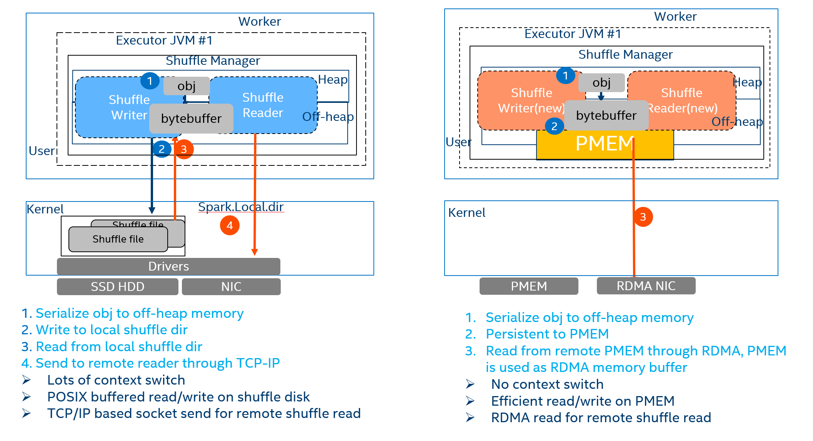

# Shuffle Remote PMem Extension for Apache Spark Guide


[1. Shuffle Remote PMem Extension introduction](#shuffle-remote-pmem-extension-introduction)  
[2. Recommended HW environment](#recommended-hw-environment)  
[3. Install and configure PMem](#install-and-configure-pmem)  
[4. Configure and Validate RDMA](#configure-and-validate-rdma)  
[5. Install dependencies for Shuffle Remote PMem Extension](#install-dependencies-for-shuffle-remote-pmem-extension)  
[6. Install Shuffle Remote PMem Extension for Spark](#install-shuffle-remote-pmem-extension-for-spark)  
[7. Shuffle Remote PMem Extension for Spark Testing](#shuffle-remote-pmem-extension-for-spark-testing)  
[Reference](#reference)   


Shuffle Remote PMem Extension for Spark (AKA. Shuffle Remote PMem Extension, previously Spark-PMoF) depends on multiple
native libraries like libfabrics, libcuckoo, PMDK. This enabling guide
covers the installing process for the time being, but it might change as
the install commands and related dependency packages for the 3rd party
libraries might vary depending on the OS version and distribution you are
using.
Yarn, HDFS, Spark installation and configuration is out of the scope of this document.

## <a id="shuffle-remote-pmem-extension-introduction"></a>1. Shuffle Remote PMem Extension introduction

Intel Optane DC persistent memory is the next-generation storage
at memory speed. It closes the performance gap between DRAM memory
technology and traditional NAND SSDs. Remote Persistent Memory extends PMem usage to new
scenario, lots of new usage cases & value proposition can be developed.

Spark shuffle is a high cost operation as it issues a great number of
small random disk IO, serialization, network data transmission, and thus
contributes a lot to job latency and could be the bottleneck for
workloads performance.

Shuffle Remote PMem Extension for spark (previously Spark PMoF)
<https://github.com/Intel-bigdata/Spark-PMoF>) is a Persistent Memory
over Fabrics (PMoF) plugin for Spark shuffle, which leverages the RDMA
network and remote persistent memory (for read) to provide extremely
high performance and low latency shuffle solutions for Spark to address performance issues for shuffle intensive workloads. 

Shuffle Remote PMem Extension brings follow benefits:

-   Leverage high performance persistent memory as shuffle media as well
    as spill media, increased shuffle performance and reduced memory
    footprint
-   Using PMDK libs to avoid inefficient context switches and memory
    copies with zero-copy remote access to persistent memory.
-   Leveraging RDMA for network offloading

The Figure 1 shows the high level architecture of Shuffle Remote PMem Extension, it shows how data flows between Spark and shuffle devices in
Shuffle Remote PMem Extension for spark shuffle and Vanilla Spark. In this guide, we
will introduce how to deploy and use Shuffle Remote PMem Extension for Spark.



Figure 1: Shuffle Remote PMem Extension for Spark

## <a id="recommended-hw-environment"></a>2. Recommended HW environment

### 2.1. System Configuration 
--------------------------
#### 2.1.1 HW and SW Configuration 
--------------------------
A 4x or 3x Node cluster is recommended for a proof of concept tests, depending your
system configurations, if using 3 nodes cluster, the Name node and Spark
Master node can be co-located with one of the Hadoop data nodes.

**Hardware:**
-   Intel® Xeon™ processor Gold 6240 CPU @ 2.60GHz, 384GB Memory (12x
    32GB 2666 MT/s) or 192GB Memory (12x 16GB 2666MT/s)
-   An RDMA capable NIC, 40Gb+ is preferred. e.g., 1x Intel X722 NIC or
    Mellanox ConnectX-4 40Gb NIC
    -   RDMA cables:
    -   Mellanox MCP1600-C003 100GbE 3m 28AWG
-   Shuffle Devices：
    -   1x 1TB HDD for shuffle (baseline)
    -   4x 128GB Persistent Memory for shuffle
-   4x 1T NVMe for HDFS
**Switch**:
    -   Arista 7060 CX2 (7060CX2-32S-F) 100Gb switches was used
  
- Please refer to section 4.2 for configurations
**Software:**
-   Hadoop 2.7
-   Spark 2.4.4
-   Fedora 29 with ww08.2019 BKC

### 2.2. Recommended RDMA NIC
-------------------------

Shuffle Remote PMem Extension is using HPNL
(<https://cloud.google.com/solutions/big-data/>) for network
communication, which leverages libfabric for efficient network
communication, so a RDMA capable NIC is recommended. Libfabric supports
RoCE, iWrap, IB protocol, so various RNICs with different protocol can
be used.

### 2.3 Recommended PMEM configuration
-----------------------------------

It is recommended to install 4+ PMem DIMMs on the SUT, but you can
adjust the numbers accordingly. In this enabling guide, 4x 128GB PMEMM
was installed on the SUT as an exmaple. 

### 2.4 Recommended PMEM BKC (optional) 
--------------------------

This development guide was based on ww08.2019 BKC (best known configuration). Please contact your HW vendor for latest BKC.

Please refer to backup if you do not have BKC access. BKC
installation/enabling or FW installation is out of the scope of this guide.

## <a id="install-and-configure-pmem"></a>3. Install and configure PMEM (example) 

1)  Please install *ipmctl* and *ndctl* according to your OS version
2)  Run *ipmctl show -dimm* to check whether dimms can be recognized
3)  Run *ipmctl create -goal PersistentMemoryType=AppDirect* to create AD
    mode
4)  Run *ndctl list -R*, you will see **region0** and **region1**. 
5)  Assume you have 4x PMEM installed on 1 node.  
    a.  Run *ndctl create-namespace -m devdax -r region0 -s 120g*  
    b.  Run *ndctl create-namespace -m devdax -r region0 –s 120g*  
    c.  Run *ndctl create-namespace -m devdax -r region1 –s 120g*  
    d.  Run *ndctl create-namespace -m devdax -r region1 –s 120g*  
    This will create four namespaces, namely /dev/dax0.0, /dev/dax0.1, /dev/dax1.0,
        /dev/dax1.1 in that node, and it will be used as Shuffle Remote PMem Extension media. 

        You can change your configuration (namespaces numbers, size) accordingly.

## <a id="configure-and-validate-rdma"></a>4. Configure and Validate RDMA
------------------------
**Notes**
This part is vendor specific, it might NOT apply to your environment, please check your switch, NIC manuals accordingly. 

### 4.1 Configure and test iWARP RDMA
---------------------------------

####  4.1.1 Download rdma-core and install dependencies

The rdma-core provides the necessary **userspace libraries** to test
rdma connectivity with tests such as rping. Refer to latest rdma-core
documentation for updated installation guidelines (https://github.com/linux-rdma/rdma-core.git).

You might refer to HW specific instructions or guide to enable your
RDMA NICs. Take Mellanox as an example, perform below steps to enable
it:
``` bash
git clone <https://github.com/linux-rdma/rdma-core.git>
dnf install cmake gcc libnl3-devel libudev-devel pkgconfig
    valgrind-devel ninja-build python3-devel python3-Cython
    python3-docutils pandoc
 //change to yum on centos
 bash build.sh
 #on centos 7
 yum install cmake gcc libnl3-devel libudev-devel make pkgconfig
    valgrind-devel
 yum install epel-release
 yum install cmake3 ninja-build pandoc
``` 
####  4.1.2 Switch Configuration (optional)

This part is HW specific, **please check your switch manual accordingly.** 
Connect the console port to PC. Username is admin. No password. Enter
global configuration mode.

Below example is based on Arista 7060 CX2 100Gb Switch, it is to configure the
100Gb port to work at 40Gb to match the NIC speed. *It is NOT required if your NIC and calbes are match.*

**Config Switch Speed to 40Gb/s**

```
switch# enable
switch# config
switch(config)# show interface status
```
**Configure corresponding port to 40 Gb/s to match the NIC speed**
```
switch(config)# interface Et(num_of_port)/1
switch(config)# speed forced 40gfull
```
RoCE might have performance issues, so PFC configuration is strongly
suggested. You will need to check the RDMA NIC driver manual and switch
manual to configure PFC. Below is the example for ConnectX-4 and Arista
7060-CX2 switches.

Below is to set the two connection ports in the same vlan and
configure it in trunk mode.

**Configure interface as trunk mode and add to vlan**
```bash
switch(config)# vlan 1
switch(config-vlan-1)#
switch(config)# interface ethernet 12-16
switch(config-if-Et12-16)# switchport trunk allowed vlan 1
switch (config-if-et1) # **priority-flow-control on**
switch (config-if-et1) # **priority-flow-control priority 3 no-drop**
```

#### 4.1.3 Download and install drivers

#### A. Example: Mellanox Enabling RoCE V2 RDMA (Optional) 

There are lots of packages need to be installed for dependency, please refer to your RDMA NIC's manualls to install it correctly. 
``` bash
yum install atk gcc-gfortran tcsh gtk2 tcl tk
```
please install NIC drivers accordingly.
``` bash
# Download MLNX_OFED_LINUX-4.7-3.2.9.0-* from https://community.mellanox.com/s/article/howto-install-mlnx-ofed-driver 
# e.g., wget http://www.mellanox.com/downloads/ofed/MLNX_OFED-<version>/MLNX_OFED_LINUX-<version>-<distribution>-<arch>.tgz . 
tar zxf MLNX_OFED_LINUX-4.7-3.2.9.0-*
cd MLNX_OFED_LINUX-4.7-3.2.9.0-
./mlnxofedinstall --add-kernel-support.
# The process might interpret and promote you to install dependencies. Install dependencies and try again
# This process will take some time. 

```

``` bash
tar zxf MLNX_OFED_LINUX-4.7-3.2.9.0-*
cd MLNX_OFED_LINUX-4.7-3.2.9.0-
./mlnxofedinstall --add-kernel-support.
# The process might interpret and promote you to install
    dependencies. Install dependencies and try again
# This process will take some time. **
```
Restart the driver:
``` bash
/etc/init.d/openibd restart
```
Might need to unload the modules if it is in use.
Make sure the that the field link_layer is “Ethernet”. 
Then you can use following command to get the device name.

#### B. Enable PFC (Priority Flow Control) to guarantee stable performance (optional) 

Then you can use following command to gett he device name

If you’re using Mellanox NIC, PFC is a must to guarantee stable
performance.

Fetch RDMA info with rdma command:
```bash 
rdma link
0/1: i40iw0/1: state DOWN physical_state NOP
1/1: i40iw1/1: state ACTIVE physical_state NOP
2/1: mlx5_0/1: state DOWN physical_state DISABLED netdev ens803f0
3/1: mlx5_1/1: state ACTIVE physical_state LINK_UP netdev ens803f1

lspci | grep Mellanox
86:00.0 Ethernet controller: Mellanox Technologies MT27700 Family [ConnectX-4]
86:00.1 Ethernet controller: Mellanox Technologies MT27700 Family [ConnectX-4]

```
Set PFC: 

```bash 
/etc/init.d/openibd restart
mlnx_qos -i ens803f1 --pfc 0,0,0,1,0,0,0,0
modprobe 8021q
vconfig add ens803f1  100
ifconfig ens803f1.100 $ip1/$mask up //change to your own IP 
ifconfig ens803f1 $ip2/$mask up //Change to your own IP 
for i in {0..7}; do vconfig set_egress_map ens803f1.100 $i 3 ; done
tc_wrap.py -i ens803f1 -u 3,3,3,3,3,3,3,3,3,3,3,3,3,3,3,3
```

Modify the IP address part based on your environment and execute the
script.

#### 4.1.4 Check RDMA module

Make sure the following modules are loaded:
```bash 
modprobe ib_core i40iw iw_cm rdma_cm rdma_ucm ib_cm ib_uverbs
 ```
#### 4.1.5 Validate RDMA functionalities  

Check that you see your RDMA interfaces listed on each server when you
run the following command: **ibv_devices**

Check with rping for RDMA connectivity between target interface and
client interface. 

 1) Assign IPs to the RDMA interfaces on Target and Client.
 2) On Target run:rping -sdVa &lt;Target IP&gt;
 3) On Client run: rping -cdVa &lt;Target IP&gt;

Example:

On the server side:
```bash 
rping -sda $ip1
created cm_id 0x17766d0
rdma_bind_addr successful
rdma_listen

accepting client connection request
cq_thread started.
recv completion
Received rkey 97a4f addr 17ce190 len 64 from peer
cma_event type RDMA_CM_EVENT_ESTABLISHED cma_id 0x7fe9ec000c90
(child)
ESTABLISHED
Received rkey 96b40 addr 17ce1e0 len 64 from peer
server received sink adv
rdma write from lkey 143c0 laddr 1771190 len 64
rdma write completion
rping -sda $ip2
created cm_id 0x17766d0
rdma_bind_addr successful
rdma_listen
…

accepting client connection request
cq_thread started.
recv completion
Received rkey 97a4f addr 17ce190 len 64 from peer
cma_event type RDMA_CM_EVENT_ESTABLISHED cma_id 0x7fe9ec000c90
(child)
ESTABLISHED
…
Received rkey 96b40 addr 17ce1e0 len 64 from peer
server received sink adv
rdma write from lkey 143c0 laddr 1771190 len 64
rdma write completion
…
 ```
On Client run: rping -cdVa &lt;Target IP&gt;

```bash 
# Client side use .100 ip 172.168.0.209 for an example 
rping -c -a 172.168.0.209 -v -C 4
ping data: rdma-ping-0: ABCDEFGHIJKLMNOPQRSTUVWXYZ[\]^_`abcdefghijklmnopqr
ping data: rdma-ping-1: BCDEFGHIJKLMNOPQRSTUVWXYZ[\]^_`abcdefghijklmnopqrs
ping data: rdma-ping-2: CDEFGHIJKLMNOPQRSTUVWXYZ[\]^_`abcdefghijklmnopqrst
ping data: rdma-ping-3: DEFGHIJKLMNOPQRSTUVWXYZ[\]^_`abcdefghijklmnopqrstu
```
Please refer to your NIC manuual for detail instructions on how to validate RDMA works. 

## <a id="install-dependencies-for-shuffle-remote-pmem-extension"></a>5. Install dependencies for Shuffle Remote PMem Extension
---------------------------

If you have completed all steps in installation guide,  you can ignore this section and refer to [6. Install Shuffle Remote PMem Extension for Spark](#6-install-shuffle-remote-pmem-extension-for-spark).

### 5.1 Install HPNL (<https://github.com/Intel-bigdata/HPNL>)

----------------------------------------------------------

HPNL is a fast, CPU-Efficient network library designed for modern
network technology. HPNL depends on Libfabric, which is protocol
independent, it supports TCP/IP, RoCE, IB, iWRAP etc. Please make sure
the Libfabric is installed in your setup. Based on this
[issue](https://github.com/ofiwg/libfabric/issues/5548), please make sure NOT
to install Libfabric 1.9.0.

You might need to install automake/libtool first to resolve dependency
issues.

```bash
git clone https://github.com/ofiwg/libfabric.git
cd  libfabric
git checkout v1.6.0
./autogen.sh
./configure --disable-sockets --enable-verbs --disable-mlx
make -j && sudo make install
```
#### 5.1.1 Build and install HPNL

Assume *Project_root_path* is HPNL folder’s path, *HPNL* here. 

```bash
sudo apt-get install cmake libboost-dev libboost-system-dev

#Fedora
dnf install cmake boost-devel boost-system
git clone https://github.com/Intel-bigdata/HPNL.git
cd HPNL
git checkout origin/spark-pmof-test --track
git submodule update --init --recursive
mkdir build; cd build
cmake -DWITH_VERBS=ON ..
make -j && make install
cd ${project_root_path}/java/hpnl
mvn install
```

### 5.2 install basic C library dependencies
--------------------------
```bash
yum install -y autoconf asciidoctor kmod-devel.x86\_64 libudev-devel libuuid-devel json-c-devel jemalloc-devel
yum groupinstall -y "Development Tools"
```

### 5.3 install ndctl
-------------------
This can be installed with your package managmenet tool as well. 
```bash
git clone https://github.com/pmem/ndctl.git
cd ndctl
git checkout v63
./autogen.sh
./configure CFLAGS='-g -O2' --prefix=/usr --sysconfdir=/etc
    --libdir=/usr/lib64
make -j
make check
make install
```
 
### 5.4 install PMDK
------------------

```bash
yum install -y pandoc
git clone https://github.com/pmem/pmdk.git
cd pmdk
git checkout tags/1.8
make -j && make install
export PKG_CONFIG_PATH=/usr/local/lib64/pkgconfig/:$PKG_CONFIG_PATH
echo “export PKG_CONFIG_PATH=/usr/local/lib64/pkgconfig/:$PKG_CONFIG_PATH” > /etc/profile.d/pmdk.sh

```

### 5.5 Install RPMem extension
-----------------------------------------------
```bash
git clone  https://github.com/efficient/libcuckoo
cd libcuckoo
mkdir build
cd build
cmake -DCMAKE_INSTALL_PREFIX=/usr/local -DBUILD_EXAMPLES=1 -DBUILD_TESTS=1 ..
make all && make install
git clone -b v0.8.1-spark-2.4.4 https://github.com/intel-bigdata/OAP.git
cd OAP/oap-shuffle/RPMem-shuffle
mvn install -DskipTests

```

## <a id="install-shuffle-remote-pmem-extension-for-spark"></a>6. Install Shuffle Remote PMem Extension for Spark
---------------------------

### 6.1 Configure RPMem extension for spark shuffle in Spark
--------------------------------------------------------

Shuffle Remote PMem Extension for spark shuffle is designed as a plugin to Spark.
Currently the plugin supports Spark 2.4.4 and works well on various
Network fabrics, including Socket, RDMA and Omni-Path. There are several
configurations files needs to be modified in order to run Shuffle Remote PMem Extension. 

#### Prerequisite
Use below command to remove original initialization of one PMem, this is a
**MUST** step, or RPMemShuffle won’t be able to open PMem devices.
```bash
pmempool rm ${device_name}
#example: pmempool rm /dev/dax0.0
```

**Refer to the Reference section for detail descrption of each parameter.** 

#### Enable RPMemShuffle
```bash
spark.shuffle.manager						 org.apache.spark.shuffle.pmof.PmofShuffleManager
spark.driver.extraClassPath                                 /$path/oap-shuffle/RPMem-shuffle/core/target/oap-rpmem-shuffle-java-0.8.1-jar-with-dependencies.jar
spark.executor.extraClassPath                               /$path/oap-shuffle/RPMem-shuffle/core/target/oap-rpmem-shuffle-java-0.8.1-jar-with-dependencies.jar

```
#### Switch On/Off PMem and RDMA
```bash
spark.shuffle.pmof.enable_rdma 					true
spark.shuffle.pmof.enable_pmem 					true
```

#### Add PMem information to spark config

Explanation: 
spark.shuffle.pmof.pmem\_capacity: the capacity of one PMem device, this
value will be used when register PMem device to RDMA. 

spark.shuffle.pmof.pmem\_list: a list of all local PMem device, make
sure your per physical node executor number won’t exceed PMem device
number, or one PMem device maybe opened by two spark executor processes
and this will leads to a PMem open failure.

spark.shuffle.pmof.dev\_core\_set: a mapping of which core range will be
task set to which PMem device, this is a performance optimal
configuration for better PMem numa accessing.

spark.io.compression.codec: use “snappy” to do shuffle data and spilling
data compression, this is a **MUST** when enabled PMem due to a default LZ4 ByteBuffer incompatible issue.
```bash
spark.shuffle.pmof.pmem_capacity    				${total_size_of_one_device}
spark.shuffle.pmof.pmem_list              			${device_name},${device_name},…
spark.shuffle.pmof.dev_core_set         			${device_name}:${core_range};…
#example: 
/dev/dax0.0:0-17,36-53;/dev/dax0.2:0-17,36-53
spark.io.compression.codec                  			snappy

```
#### Memory configuration suggestion

Suitable for any release before OAP 0.8. In OAP 0.8 release, the memory footprint of each core is reduced dramatically and the formula below is not applicable any more.  

Spark.executor.memory must be greater than shuffle\_block\_size \*
numPartitions \* numCores \* 2 (for both shuffle and external sort), for example, default HiBench Terasort
numPartition is 200, and we configured 10 cores each executor, then this
executor must has memory capacity greater than
2MB(spark.shuffle.pmof.shuffle\_block\_size) \* 200 \* 10 \* 2 = 8G. 

Recommendation configuration as below, but it needs to be adjusted accordingly based on your system configurations. 
```bash 
Yarn.executor.num    4                                          // same as PMem namespaces number
Yarn.executor.cores  18                                     	// total core number divide executor number
spark.executor.memory  15g                                      // 2MB * numPartition(200) * 18 * 2
spark.yarn.executor.memoryOverhead 5g                        	// 30% of  spark.executor.memory
spark.shuffle.pmof.shuffle_block_size   2096128          	// 2MB – 1024 Bytes
spark.shuffle.pmof.spill_throttle       2096128                 // 2MB – 1024 Bytes, spill_throttle is used to
                                                                // set throttle by when spill buffer data to
								// Persistent Memory, must set spill_throttle
								// equal to shuffle_block_size
spark.driver.memory    						10g
spark.yarn.driver.memoryOverhead 				5g


```
**Configuration of RDMA enabled case**

spark.shuffle.pmof.node : spark nodes and RDMA ip mapping list  
spark.driver.rhost / spark.driver.rport : Specify spark driver RDMA IP and port

```bash 
spark.shuffle.pmof.server_buffer_nums                 		64
spark.shuffle.pmof.client_buffer_nums                  		64
spark.shuffle.pmof.map_serializer_buffer_size    		262144
spark.shuffle.pmof.reduce_serializer_buffer_size 		262144
spark.shuffle.pmof.chunk_size                                 	262144
spark.shuffle.pmof.server_pool_size                      	3
spark.shuffle.pmof.client_pool_size                       	3
spark.shuffle.pmof.node                                         $HOST1-$IP1,$HOST2-$IP2//Host-IP pairs, $hostname-$ip
spark.driver.rhost                                              $IP //change to your host IP 
spark.driver.rport                                              61000

```
## <a id="shuffle-remote-pmem-extension-for-spark-testing"></a>7. Shuffle Remote PMem Extension for Spark Testing 
-----------------------------

RPmem shuffle extension have been tested and validated with Terasort and Decision support workloads. 

### 7.1 Decision support workloads 
-------------------------------

The  Decision support workloads is a decision support benchmark that
models several general applicable aspects of a decision support system,
including queries and data maintenance.

#### 7.1.1 Download spark-sql-perf

The link is <https://github.com/databricks/spark-sql-perf> and follow
README to use sbt build the artifact.

#### 7.1.2 Download the kit 

As per instruction from spark-sql-perf README, tpcds-kit is required and
please download it from <https://github.com/databricks/tpcds-kit>,
follow README to setup the benchmark.

#### 7.1.3 Prepare data

As an example, generate parquet format data to HDFS with 1TB data scale.
The data stored path, data format and data scale are configurable.
Please check script below as a sample.

``` scala 
import com.databricks.spark.sql.perf.tpcds.TPCDSTables
import org.apache.spark.sql.\_
// Set:
val rootDir: String = "hdfs://${ip}:9000/tpcds_1T" 		// root directory of location to create data in.
val databaseName: String = "tpcds_1T" 				// name of database to create.
val scaleFactor: String = "1024" 				// scaleFactor defines the size of the dataset to generate (in GB).
val format: String = "parquet" 					// valid spark format like parquet "parquet".
val sqlContext = new SQLContext(sc)
// Run:
val tables = new TPCDSTables(sqlContext, dsdgenDir = "/mnt/spark-pmof/tool/tpcds-kit/tools", // location of dsdgen
scaleFactor = scaleFactor,
useDoubleForDecimal = false, 					// true to replace DecimalType with DoubleType
useStringForDate = false) 					// true to replace DateType with  StringType
  tables.genData(
    location = rootDir,
    format = format,
    overwrite = true, 						// overwrite the data that is already there
    partitionTables = true, 					// create the partitioned fact tables
    clusterByPartitionColumns = true, 				// shuffle to get partitions coalesced into single files.
    filterOutNullPartitionValues = false, 			// true to filter out the partition with NULL key value
    tableFilter = "", 						// "" means generate all tables
    numPartitions = 400) 					// how many dsdgen partitions to run - number of input tasks.
// Create the specified database
sql(s"create database $databaseName")
// Create metastore tables in a specified database for your data.
// Once tables are created, the current database will be switched to the specified database.

tables.createExternalTables(rootDir, "parquet", databaseName, overwrite = true, discoverPartitions = true)

```
#### 7.1.4 Run the benchmark

Launch DECISION SUPPORT WORKLOADS queries on generated data, check
*benchmark.scale* below as a sample, it runs query64.
``` scala 
import com.databricks.spark.sql.perf.tpcds.TPCDS
import org.apache.spark.sql._
val sqlContext = new SQLContext(sc)
val tpcds = new TPCDS (sqlContext = sqlContext)
// Set:
val databaseName = "tpcds_1T" 					// name of database with TPCDS data.
val resultLocation = "tpcds_1T_result" 				// place to write results
val iterations = 1 						// how many iterations of queries to run.
val query_filter = Seq("q64-v2.4")
val randomizeQueries = false
def queries = {
val filtered_queries = query_filter match {
case Seq() => tpcds.tpcds2_4Queries
case _=>  tpcds.tpcds2_4Queries.filter(q =>
    query_filter.contains(q.name))
 }
filtered_queries
}
val timeout = 24*60*60 						// timeout, in seconds.
// Run:
sql(s"use $databaseName")
val experiment = tpcds.runExperiment(
queries,
iterations = iterations,
resultLocation = resultLocation,
forkThread = true)
experiment.waitForFinish(timeout)
```
#### 7.1.5 Check the result

Check the result under *tpcds\_1T\_result* folder. It can be an option
to check the result at spark history server. (Need to start history server by
*\$SPARK\_HOME/sbin/start-history-server.sh*)

### 7.2 TeraSort
------------

TeraSort is a benchmark that measures the amount of time to sort one
terabyte of randomly distributed data on a given computer system.

#### 7.2.1 Download HiBench
This guide uses HiBench for Terasort tests, <https://github.com/Intel-bigdata/HiBench>. HiBench is a
big data benchmark suite and contains a set of Hadoop, Spark and
streaming workloads including TeraSort.

#### 7.2.2 Build HiBench as per instructions from [build-bench](https://github.com/Intel-bigdata/HiBench/blob/master/docs/build-hibench.md). 

#### 7.2.3 Configuration

Modify *\$HiBench-HOME/conf/spark.conf* to specify the spark home and
other spark configurations. It will overwrite the configuration of
*\$SPARK-HOME/conf/spark-defaults.conf* at run time.

#### 7.2.4 Launch the benchmark

Need to prepare the data with

*\$HiBench-HOME/bin/workloads/micro/terasort/prepare/prepare.sh*

Kick off the evaluation by
\$HiBench-HOME/bin/workloads/micro/terasort/spark/run.sh

Change directory to *\$HiBench-HOME/bin/workloads/micro/terasort/spark*
and launch the *run.sh*. You can add some PMEM cleaning work to make sure
it starts from empty shuffle device every test iteration. Take *run.sh*
below as a sample.

```bash 
# ***Change below command accordingly ***
ssh ${node} pmempool rm /dev/dax0.0

current_dir=`dirname "$0"`
current_dir=`cd "$current_dir"; pwd`
root_dir=${current_dir}/../../../../..
workload_config=${root_dir}/conf/workloads/micro/terasort.conf
. "${root_dir}/bin/functions/load_bench_config.sh"

enter_bench ScalaSparkTerasort ${workload_config} ${current_dir}
show_bannar start

rmr_hdfs $OUTPUT_HDFS || true

SIZE=`dir_size $INPUT_HDFS`
START_TIME=`timestamp`
run_spark_job com.intel.hibench.sparkbench.micro.ScalaTeraSort $INPUT_HDFS $OUTPUT_HDFS
END_TIME=`timestamp`
	
gen_report ${START_TIME} ${END_TIME} ${SIZE}
show_bannar finish
leave_bench

```

#### 7.2.5 Check the result

Check the result at spark history server to see the execution time and
other spark metrics like spark shuffle spill status. (Need to start
history server by *\$SPARK\_HOME/sbin/start-history-server.sh*)

## <a id="reference"></a>Reference 
----------------------------

### RPMemShuffle Spark configuration
---------------------------------
```bash 
Before running Spark workload, add following contents in
spark-defaults.conf.

Yarn.executor.num    4                                      // same as PMem devices number
Yarn.executor.cores  18                                     // total core number divide executor number
spark.executor.memory  15g                                  // 2MB * numPartition(200) * 18 * 2
spark.yarn.executor.memoryOverhead 5g                       // 30% of  spark.executor.memory
spark.shuffle.pmof.shuffle_block_size   2096128             // 2MB – 1024 Bytes
spark.shuffle.pmof.spill_throttle       2096128             // 2MB – 1024 Bytes

spark.driver.memory    10g
spark.yarn.driver.memoryOverhead 5g

spark.io.compression.codec                                  snappy
spark.driver.extraClassPath                                 /$path/oap-shuffle/RPMem-shuffle/core/target/oap-rpmem-shuffle-java-0.8.1-jar-with-dependencies.jar
spark.executor.extraClassPath                               /$path/oap-shuffle/RPMem-shuffle/core/target/oap-rpmem-shuffle-java-0.8.1-jar-with-dependencies.jar
spark.shuffle.manager                                       org.apache.spark.shuffle.pmof.PmofShuffleManager
spark.shuffle.pmof.enable_rdma                              true
spark.shuffle.pmof.enable_pmem                              true
spark.shuffle.pmof.pmem_capacity                            126833655808 // size should be same as pmem size
spark.shuffle.pmof.pmem_list                                /dev/dax0.0, /dev/dax0.1, /dev/dax0.2, /dev/dax0.3, /dev/dax1.0,/dev/dax1.1, /dev/dax1.2,/dev/dax1.3
spark.shuffle.pmof.dev_core_set                             dax0.0:0-17,dax0.1:0-17,dax0.2:36-53,dax0.3:36-53,dax1.0:18-35, dax1.1:18-35,dax1.2:54-71,dax1.3:54-71
spark.shuffle.pmof.server_buffer_nums                       64
spark.shuffle.pmof.client_buffer_nums                       64
spark.shuffle.pmof.map_serializer_buffer_size               262144
spark.shuffle.pmof.reduce_serializer_buffer_size            262144
spark.shuffle.pmof.chunk_size                               262144
spark.shuffle.pmof.server_pool_size                         3
spark.shuffle.pmof.client_pool_size                         3
spark.shuffle.pmof.node                                     $host1-$IP1,$host2-$IP2//HOST-IP Pair, seperate with ","
spark.driver.rhost                                          $IP //change to your host
spark.driver.rport                                          61000
```
### Reference guides (without BKC access)
-----------------------------------
If you do not have BKC access, please following below official guide:
(1): General PMEMM support: PMEMM support
<https://www.intel.com/content/www/us/en/support/products/190349/memory-and-storage/data-center-persistent-memory/intel-optane-dc-persistent-memory.html>

(2) PMEMM population rule: Module DIMM Population for Intel® Optane™ DC
Persistent Memory
<https://www.intel.com/content/www/us/en/support/articles/000032932/memory-and-storage/data-center-persistent-memory.html?productId=190349&localeCode=us_en>

(3) OS support requirement: Operating System OS for Intel® Optane™ DC
Persistent Memory
<https://www.intel.com/content/www/us/en/support/articles/000032860/memory-and-storage/data-center-persistent-memory.html?productId=190349&localeCode=us_en>

(4): Quick Start Guide: Provision Intel® Optane™ DC Persistent Memory
<https://software.intel.com/en-us/articles/quick-start-guide-configure-intel-optane-dc-persistent-memory-on-linux>
